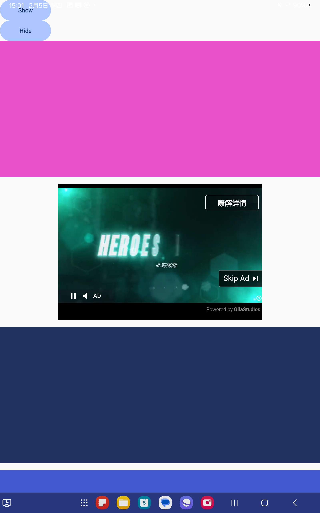
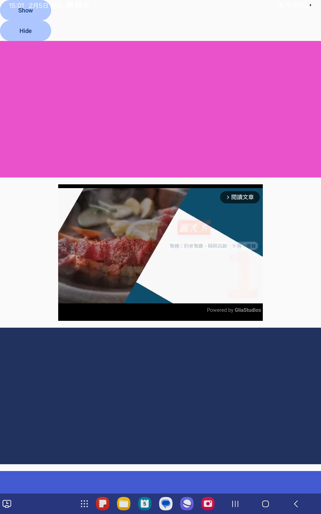
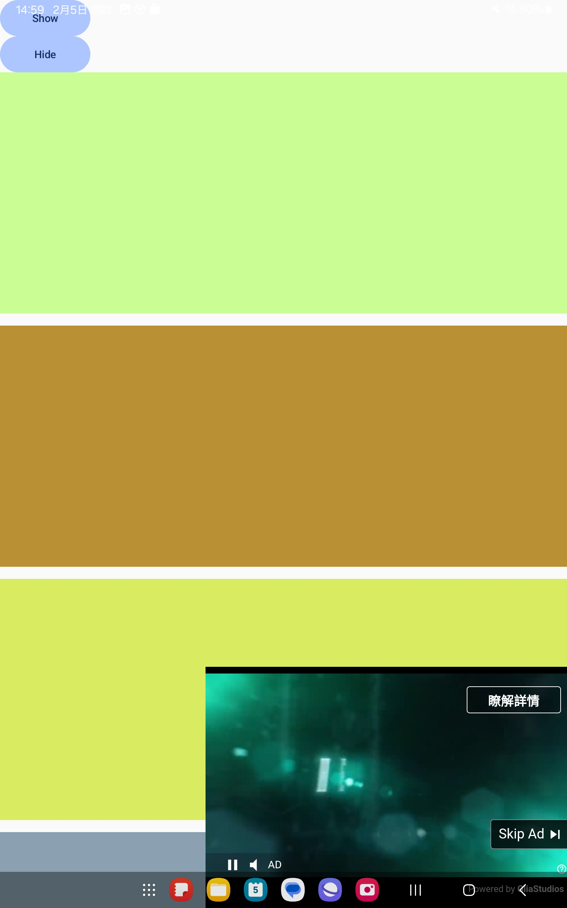
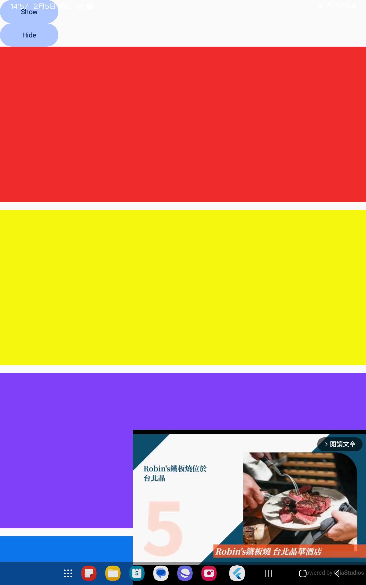

This document explains how to integrate the GliaPlayer Android SDK, a WebView-based video ad player, into an Android project.
---

## Scenarios
| Ads | Content Video|
|-------------------------|-------------------------|
| |   |
| |   |  


## Before you begin

To prepare your app, complete the steps in the following sections.

### App prerequisites
- Make sure that your app's build file uses the following values:
    - Minimum SDK version of `23` or higher
    - Compile SDK version of `35` or higher
- (Optional) For React Native:
    - React Native version of `0.74` or higher
- (Optional) Integration with Flutter
    - [Flutter Plugin](https://pub.dev/packages/gliaplayer)


## Configure your app

1. In your Gradle settings file, include the [Google's Maven repository](https://maven.google.com/web/index.html), [Maven central repository](https://search.maven.org/artifact) and [Maven GitHub Packages](https://docs.github.com/en/packages/learn-github-packages/introduction-to-github-packages). 
Make sure you have the `read:packages` scope and for the access token:

```kotlin
pluginManagement {
  repositories {
    google()
    mavenCentral()
    gradlePluginPortal()
    maven {
        name = "GitHubPackages"
        url = uri("https://maven.pkg.github.com/livingbio/GliaPlayer-Webview-Android-SDK")
        credentials {
            username = System.getenv("GITHUB_USER_ID") ?: ""
            password = System.getenv("PERSONAL_ACCESS_TOKEN") ?: ""
        }
        content {
            // Only use this repository for GliaPlayer SDK
            includeGroup("com.gliacloud")
        }
    }
  }
}

dependencyResolutionManagement {
  repositoriesMode.set(RepositoriesMode.FAIL_ON_PROJECT_REPOS)
  repositories {
    google()
    mavenCentral()
    maven {
        name = "GitHubPackages"
        url = uri("https://maven.pkg.github.com/livingbio/GliaPlayer-Webview-Android-SDK")
        credentials {
            username = System.getenv("GITHUB_USER_ID") ?: ""
            password = System.getenv("PERSONAL_ACCESS_TOKEN") ?: ""
        }
    }
  }
}

rootProject.name = "My Application"
include(":app")
```

2. Add the dependencies for Google Mobile Ads SDK to your app-level build file:

```kotlin
implementation("com.gliacloud:gliaplayer:1.0.0-beta08")
implementation("com.google.android.gms:play-services-ads:24.9.0")
```

3. Click **Sync Now**. For details on syncing, see [Sync projects with Gradle files](https://developers.android.com/build#sync-files).

4. Bypass `APPLICATION_ID` check for web view APIs for ads, in your app's `AndroidManifest.xml` file. To do so, add a <meta-data> tag with `android:name="com.google.android.gms.ads.INTEGRATION_MANAGER"`. For `android:value`, insert `webview`, surrounded by quotation marks.

```xml
<manifest>
  <application>
    <!-- Bypass APPLICATION_ID check for web view APIs for ads -->
    <meta-data
        android:name="com.google.android.gms.ads.INTEGRATION_MANAGER"
        android:value="webview"/>
  </application>
</manifest>
```

## Initialize the Google Mobile Ads SDK

Before loading ads, initialize Google Mobile Ads SDK by calling [`MobileAds.initialize()`](https://developers.google.com/ad-manager/mobile-ads-sdk/android/reference/com/google/android/gms/ads/MobileAds#initialize(android.content.Context,%20com.google.android.gms.ads.initialization.OnInitializationCompleteListener)).

This method initializes the SDK and calls a completion listener once both Google Mobile Ads SDK and adapter initializations have completed, or after a 30-second timeout. This needs to be done only once, ideally at app launch.

Here's an example of how to call the initialize() method on a background thread within an Activity:

```kotlin
CoroutineScope(Dispatchers.IO).launch {
  // Initialize the Google Mobile Ads SDK on a background thread.
  MobileAds.initialize(this@MyActivity) {}
}
```

For more detailed setups for the Google Mobile Ads SDK, please check the [official documents](https://developers.google.com/ad-manager/mobile-ads-sdk/android/quick-start#kotlin_2).


## GliaPlayer Ad Unit

1. To load an GliaPlayer, use the `GliaPlayer` composable with the `SLOT_KEY`:

```kotlin
import com.gliacloud.gliaplayer.GliaPlayer

val gliaPlayer = GliaPlayer(context).apply {
    initGliaPlayer(slot_key = "{SLOT_KEY}")
    // Register with Mobile Ads SDK for ad integration
    MobileAds.registerWebView(this)
}
```

2. Resume the video playback of the `GliaPlayer`.
```kotlin
gliaPlayer.resume()
```

3. To pause the video playback.
```kotlin
gliaPlayer.pause()
```

4. To automatically `resume()`/`pause()` video playback depending on the visibility state of the View:
In `MainActivity.kt`
```kotlin
import com.gliacloud.gliaplayer.GliaPlayer
import com.gliacloud.gliaplayer.PlayerVisibilityTracker

val gliaPlayer = GliaPlayer(context).apply {
    initGliaPlayer(slot_key = "{SLOT_KEY}")
    // Register with Mobile Ads SDK for ad integration
    MobileAds.registerWebView(this)
}

// init PlayerVisibilityTracker()
private val = PlayerVisibilityTracker(gliaPlayer)
visibilityTracker.startTracking()

override fun onPause() {
    super.onPause()
    visibilityTracker?.stopTracking()
    gliaPlayer?.onPause()
}

override fun onResume() {
    super.onResume()
    gliaPlayer?.onResume()
    visibilityTracker?.startTracking()
}

```

## Sample Code

```kotlin
package com.example.gliaplayer_andriod_poc

import android.os.Bundle
import androidx.activity.ComponentActivity
import androidx.activity.compose.setContent
import androidx.activity.enableEdgeToEdge
import androidx.compose.foundation.background
import androidx.compose.foundation.layout.Box
import androidx.compose.foundation.layout.Column
import androidx.compose.foundation.layout.Spacer
import androidx.compose.foundation.layout.fillMaxSize
import androidx.compose.foundation.layout.fillMaxWidth
import androidx.compose.foundation.layout.height
import androidx.compose.foundation.layout.width
import androidx.compose.foundation.rememberScrollState
import androidx.compose.foundation.verticalScroll
import androidx.compose.ui.Alignment
import androidx.compose.ui.Modifier
import androidx.compose.ui.graphics.Color
import androidx.compose.ui.unit.dp
import androidx.compose.ui.viewinterop.AndroidView
import com.example.gliaplayer_andriod_poc.ui.theme.GliaPlayer_Andriod_POCTheme
import com.gliacloud.gliaplayer.GliaPlayer
import com.gliacloud.gliaplayer.PlayerVisibilityTracker
import com.google.android.gms.ads.MobileAds
import kotlinx.coroutines.CoroutineScope
import kotlinx.coroutines.Dispatchers
import kotlinx.coroutines.launch
import kotlin.random.Random

class MainActivity : ComponentActivity() {
    private var gliaPlayer: GliaPlayer? = null
    private var visibilityTracker: PlayerVisibilityTracker? = null
    override fun onCreate(savedInstanceState: Bundle?) {
        super.onCreate(savedInstanceState)
        enableEdgeToEdge()

        // Initialize Mobile Ads SDK
        CoroutineScope(Dispatchers.IO).launch {
            // Initialize the Google Mobile Ads SDK on a background thread.
            MobileAds.initialize(this@MainActivity) {}
        }

        setContent {
            GliaPlayer_Andriod_POCTheme {
                Box(Modifier.fillMaxSize()) {
                    Column(
                        Modifier
                            .fillMaxSize()
                            .verticalScroll(rememberScrollState())
                    ) {
                        for (i in 1..100) {
                            Box(
                                Modifier
                                    .fillMaxWidth()
                                    .height(320.dp)
                                    .background(
                                        Color(
                                            Random.nextFloat(),
                                            Random.nextFloat(),
                                            Random.nextFloat(),
                                            1f
                                        )
                                    )
                            )
                            Spacer(Modifier.height(16.dp))
                        }
                    }
                    AndroidView(
                        modifier = Modifier
                            .width(480.dp)
                            .height(320.dp)
                            .align(Alignment.BottomEnd),
                        factory = { context ->
                            GliaPlayer(context).apply {
                                initGliaPlayer(slot_key = "gliacloud_app_test")
                                // Register with Mobile Ads SDK for ad integration
                                MobileAds.registerWebView(this)
                            }.also {
                                gliaPlayer = it
                                visibilityTracker = PlayerVisibilityTracker(it)
                                visibilityTracker?.startTracking()
                            }
                        }
                    )
                }
            }
        }
    }

    override fun onPause() {
        super.onPause()
        visibilityTracker?.stopTracking()
        gliaPlayer?.onPause()
    }

    override fun onResume() {
        super.onResume()
        gliaPlayer?.onResume()
        visibilityTracker?.startTracking()
    }
}
```

## License

    Copyright 2026 GliaCloud

    Licensed under the Apache License, Version 2.0 (the "License");
    you may not use this file except in compliance with the License.
    You may obtain a copy of the License at

       https://www.apache.org/licenses/LICENSE-2.0

    Unless required by applicable law or agreed to in writing, software
    distributed under the License is distributed on an "AS IS" BASIS,
    WITHOUT WARRANTIES OR CONDITIONS OF ANY KIND, either express or implied.
    See the License for the specific language governing permissions and
    limitations under the License.